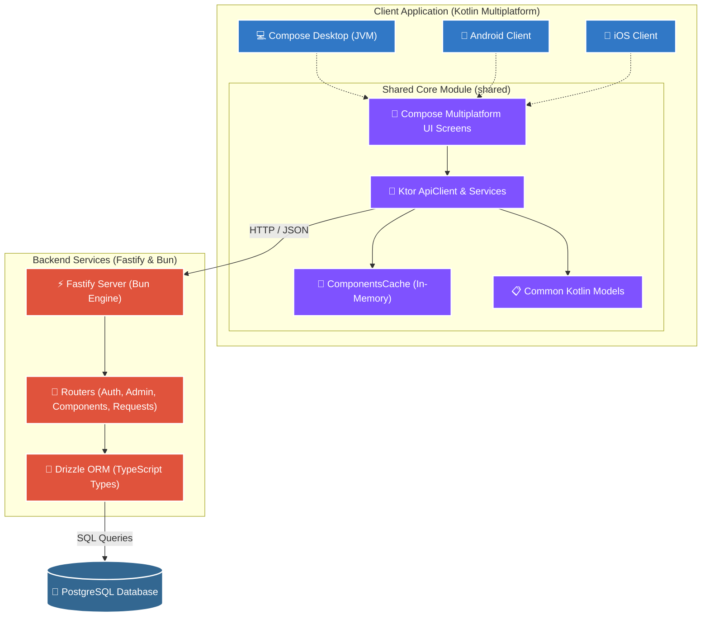
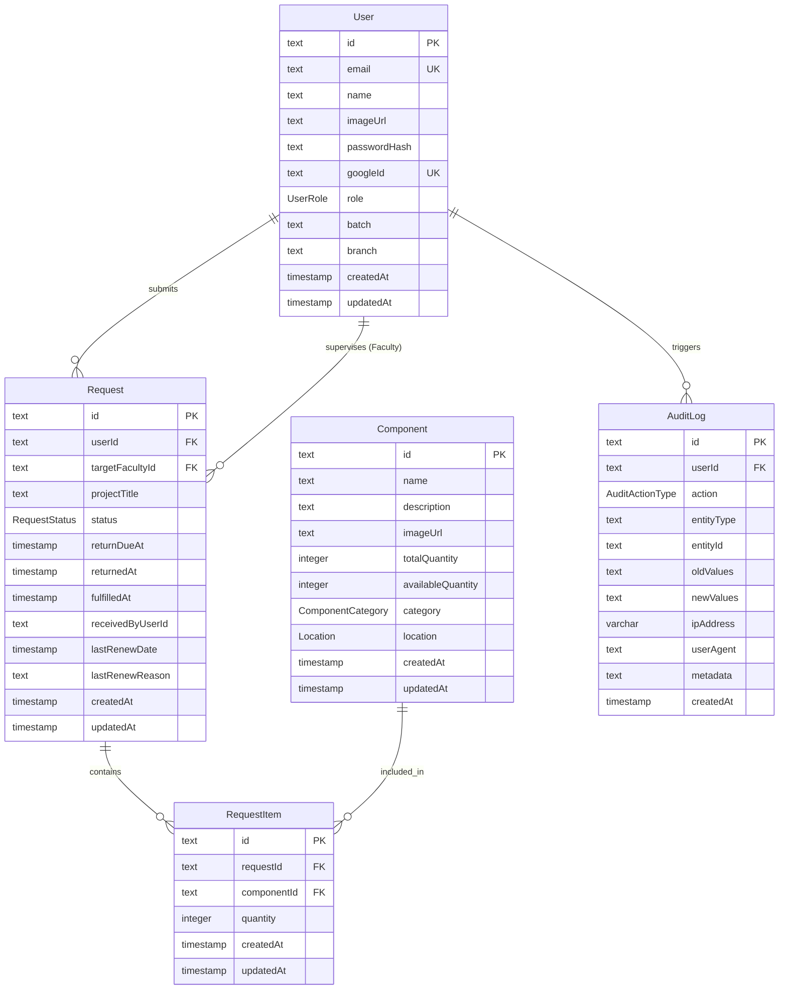
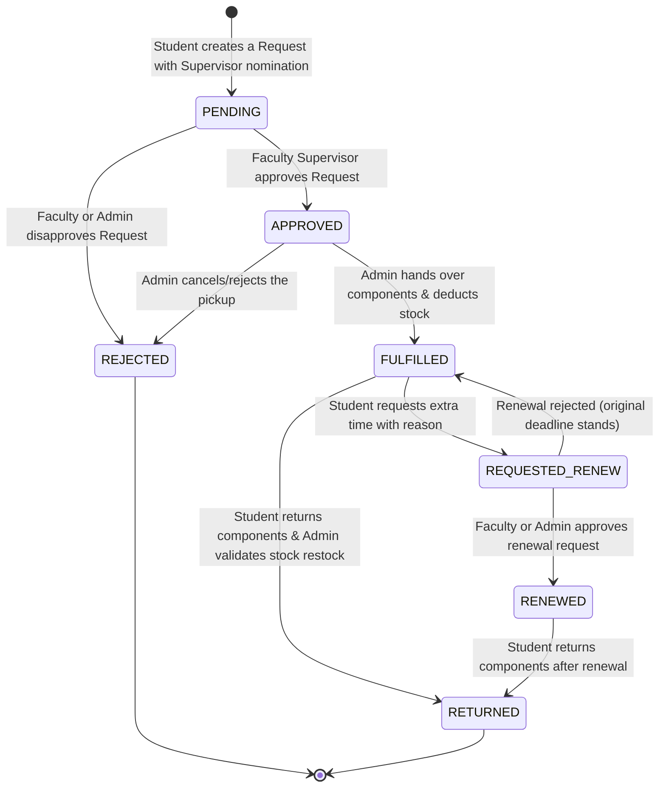

# 🎓 IIIT-NR Inventory App

[](https://github.com/sharifmdathar/iiitnr-inventory-app/releases)
[](https://github.com/sharifmdathar/iiitnr-inventory-app/releases)
[](https://www.codefactor.io/repository/github/sharifmdathar/iiitnr-inventory-app)


[](https://kotlinlang.org/docs/multiplatform.html)
[](https://fastify.dev/)
[](https://bun.sh/)
[](https://orm.drizzle.team/)
[](https://github.com/JetBrains/compose-multiplatform)
[](#)

A state-of-the-art, secure, and robust **Inventory & Item Issue-Return Management System** custom-built for the **International Institute of Information Technology, Naya Raipur (IIIT-NR)**. This workspace comprises a cross-platform client app built using **Kotlin Multiplatform (KMP) & Compose Multiplatform** paired with a ultra-fast backend engine driven by **Fastify, Bun, Drizzle ORM, and PostgreSQL**.

---

## 📌 Table of Contents

- [✨ Key Features](#-key-features)
- [🏗️ System Architecture](#️-system-architecture)
- [🗄️ Database Schema & Entities](#️-database-schema--entities)
- [🔄 Issue & Return Request Lifecycle](#-issue--return-request-lifecycle)
- [🛠️ Tech Stack & Dependencies](#️-tech-stack--dependencies)
- [🚀 Quick Start & Development Setup](#-quick-start--development-setup)
  - [Prerequisites](#prerequisites)
  - [Backend Setup](#backend-setup)
  - [Kotlin Multiplatform App Setup](#kotlin-multiplatform-app-setup)
- [🧰 Justfile Task Runner Cheatsheet](#-justfile-task-runner-cheatsheet)
- [🛡️ Code Quality & Static Analysis](#️-code-quality--static-analysis)

---

## ✨ Key Features

### 👤 Role-Based Auth & Profiles (RBAC)
- **Multi-Role Matrix:** Features strict role-based verification supporting five tiers: `STUDENT`, `TA` (Teaching Assistant), `FACULTY`, `ADMIN`, and `PENDING`.
- **Automatic Batch/Branch Derivation:** Student batch (graduation range, e.g., `2024-2028`) and branch (`CSE`, `ECE`, `DSAI`) are derived automatically from their institutional email address during signup or profile fetches.
- **Domain Gatekeeping:** Restricts registration/login to IIIT-NR emails via `ALLOWED_EMAIL_DOMAIN` configuration (e.g., `@iiitnr.edu.in`), protecting college resources.
- **Dual Authentication:** Supports traditional email-password credentials alongside secure Google Sign-in.
- **User Management Panel:** Provides administrators with a user panel to search registered accounts and update user details (names, roles, batches, and branches).

### 📦 Lab & Component Catalog Management
- **Hierarchical Layout:** Components organized by categories (`Sensors`, `Actuators`, `Microcontrollers`, `Microprocessors`, `Others`).
- **Physical Locations:** Tracks lab inventory mapping directly to physical college labs (`IoT_Lab`, `Robo_Lab`, `VLSI_Lab`).
- **Real-time Stock Auditing:** Separates `totalQuantity` from `availableQuantity` dynamically, updating automatically as items are requested, approved, and returned.
- **Platform-Native Data Export:** Built-in tool to export the component database to a CSV file from the client top bar (uses platform-specific storage on Android and Desktop).

### 🔄 Multi-State Issue, Return & Renewal System
- **Project Nominated Issues:** Students/TAs issue items under specific project titles and name a nominating `FACULTY` supervisor.
- **Fulfillment & Due Tracking:** Approved requests are fulfilled by admins/TAs, automatically setting a 30-day return due date (`returnDueAt`).
- **Request Renewals:** Students/TAs can submit renewal requests with a detailed reason, allowing nominating faculty or admins to extend the due date by another 30 days.
- **Automatic Stock Restocking:** Returning components automatically increments `availableQuantity` on the backend, checking against `totalQuantity`.

### 🛡️ Enterprise-Grade Admin Audit Logging
- **Immutable Ledger:** Records all system activities like `CREATE`, `UPDATE`, `DELETE`, `LOGIN`, `LOGOUT`, `REQUEST_STATUS_CHANGE`, and `INVENTORY_ADJUST`.
- **System-Wide Accountability:** Stores state changes using highly detailed diffs (`oldValues` and `newValues`), tracking IP addresses, and user-agent details for advanced security audits.

### 🔄 Automatic Version Compatibility Check
- **Synchronized Deployments:** Startup compatibility check that calls the server version endpoint (`GET /version`), matching it using semantic version comparisons.
- **In-App Upgrades:** Displays a Snackbar banner to download updates from the GitHub Releases page if a newer server version is detected.

---

## 🏗️ System Architecture

The application is structured into a modern decoupled architecture. The frontend application shares Core logic, models, and network API layer across all targets (Desktop, Android, and iOS) via Kotlin Multiplatform, and connects over HTTP/JSON with the Fastify/PostgreSQL backend server.



---

## 🗄️ Database Schema & Entities

The PostgreSQL schema is powered by **Drizzle ORM** for strong typing and performance. Here are the core entities:



---

## 🔄 Issue & Return Request Lifecycle

The system utilizes an advanced, automated state machine to track components issue requests, from submission to final return:



---

## 🛠️ Tech Stack & Dependencies

### Backend Engine (`/backend`)
*   **Runtime:** [Bun Runtime](https://bun.sh/) (Extremely fast JavaScript/TypeScript runtime)
*   **Web Framework:** [Fastify 5](https://fastify.dev/) (High-performance API server framework)
*   **ORM:** [Drizzle ORM](https://orm.drizzle.team/) (Next-generation type-safe database layer)
*   **Database:** PostgreSQL (Robust and secure relational store)
*   **Security & Protection:** 
    *   `@fastify/helmet` for secure HTTP headers.
    *   `@fastify/rate-limit` for rate limiting (100 requests per minute by default).
    *   `xss` for cross-site scripting input protection.
    *   `bcryptjs` for strong password hashing.
    *   `@fastify/jwt` for stateless JSON Web Token session auth.
    *   `google-auth-library` to securely verify Google OAuth sign-in tokens.
*   **Logging:** `pino-pretty` for structured, beautiful developer logs.
*   **Testing:** Native `bun test` runner.

### Kotlin Multiplatform Client (`/app`)
*   **Target Core Architecture:** Clean Architecture separating UI, Presentation, API, Cache, and Storage.
*   **UI Engine:** Jetpack Compose Multiplatform (UI codebase shared across all targets).
*   **Navigation:** `androidx.navigation.compose` for unified screen graph routing.
*   **Networking:** [Ktor HTTP Client](https://ktor.io/) with `ContentNegotiation` and `kotlinx.serialization` for robust type-safe API requests.
*   **Local Caching:** Dedicated `ComponentsCache` for lightning-fast search queries.
*   **Token Store:** `TokenManager` for persistent JWT handling.
*   **Static Code Analysis:** Kotlin `detekt` static analyzer & `ktlint` formatter checks.

---

## 🚀 Quick Start & Development Setup

### Prerequisites
Make sure you have the following installed on your developer machine:
- [Bun Runtime](https://bun.sh/) (v1.3.11+)
- [Java Development Kit (JDK) 17+](https://adoptium.net/temurin/releases/) (Required for KMP compilation)
- [Podman](https://podman.io/) or [Docker](https://www.docker.com/) (For launching the database)
- [Just](https://github.com/casey/just) task runner (Optional, but highly recommended)

---

### Backend Setup

1. **Navigate to the Backend directory:**
   ```bash
   cd backend
   ```

2. **Install Dependencies:**
   ```bash
   bun install
   ```

3. **Configure Environment Variables:**
   Copy the existing `.env` template or modify it:
   ```env
   DATABASE_URL=postgresql://<username>:<password>@localhost:5432/iiitnr_inventory
   TEST_DATABASE_URL=postgresql://<username>:<password>@localhost:5432/iiitnr_inventory_test
   PORT=4000
   JWT_SECRET=your_super_secret_jwt_sign_key
   GOOGLE_CLIENT_ID=your_google_oauth_client_id.apps.googleusercontent.com
   ALLOWED_EMAIL_DOMAIN=@iiitnr.edu.in
   ALLOW_UNVERIFIED_EMAIL=false
   
   # Admin Seed Credentials
   ADMIN_EMAIL=admin@test.com
   ADMIN_PASSWORD=admin123
   ADMIN_NAME="System Administrator"
   ```

4. **Spin up a local PostgreSQL Instance (via Podman Compose):**
   ```bash
   # Launch DB container
   just db-up
   ```

5. **Generate & Apply Database Migrations:**
   ```bash
   # Runs migration scripts and seeds database
   bun run migrate
   ```

6. **Seed default data (Labs, Categories, Initial Admin):**
   ```bash
   bun run seed
   ```

7. **Start the API Server (Development Mode):**
   ```bash
   just dev
   ```
   The backend API will be available at `http://localhost:4000`.

---

### Kotlin Multiplatform App Setup

The frontend app shares the core UI and logic in `app/shared`, while platform specific runners exist for Desktop, Android, and iOS.

#### 1. Running the Compose Desktop Client
You can run the Desktop application immediately using the preconfigured gradle task:
```bash
cd app
./gradlew desktop:run
```
*(Or simply run `just desk` from the project root)*

#### 2. Running the Android Client
Open the `app` directory in **Android Studio**. Make sure the target emulator or physical device is connected, and select the `android` module configuration and click **Run**.

*Note: For Android Emulators to connect to local backend, ensure the ApiClient URL configuration resolves to `http://10.0.2.2:4000`.*

#### 3. Running the iOS Client
Prerequisites: macOS with Xcode installed. Open the `/app/iosApp` project workspace inside Xcode, configure your developer certs, select a simulated iOS device, and press **Cmd + R**.

---

## 🧰 Justfile Task Runner Cheatsheet

If you have `just` runner installed, you can use the following shortcuts from the **root** of the repository:

| Command | Action Description | Target Component |
| :--- | :--- | :--- |
| `just install` | Installs backend node modules using `bun` | Backend |
| `just dev` | Launches backend migration, seeds, and boots watch-mode server | Backend |
| `just db-up` | Starts a PostgreSQL instance using Compose | Database |
| `just db-down` | Tears down the PostgreSQL Compose instance | Database |
| `just up` / `just down` | Spins up/down the complete Podman Compose stack | Full Stack |
| `just logs` | Follows logs from the compose container stack | Diagnostics |
| `just test` | Launches database and executes the backend test suite | Quality / CI |
| `just desk` | Compiles and launches the desktop app locally | Compose Desktop |
| `just lint` | Runs eslint on backend and ktlint checks on client | Quality / Checks |
| `just lint-fix` | Formats both backend source files and Kotlin source files | Formatters |
| `just typecheck` | Validates TypeScript configuration and resolves type-errors | Backend TypeScript |
| `just fmt` | Prettifies backend and client files | Formatters |
| `just detekt` | Runs deep static code quality analysis on KMP project | Quality Client |

---

## 🛡️ Code Quality & Static Analysis

We maintain strict quality control standards across both projects:

*   **Backend Linting:** Fastify TypeScript styles are governed by modern ESLint and Prettier rules.
    ```bash
    just lint
    ```
*   **Kotlin Linting & Formatting:** Enforced via `ktlint` plugin.
    ```bash
    # View linting errors
    cd app && ./gradlew ktlintCheck
    # Auto-format errors
    cd app && ./gradlew ktlintFormat
    ```
*   **Kotlin Static Analysis:** detekt analyzes code complexity, potential memory leaks, code smells, and styling issues.
    ```bash
    just detekt
    ```

---

*Made with ❤️ for IIIT Naya Raipur.*
